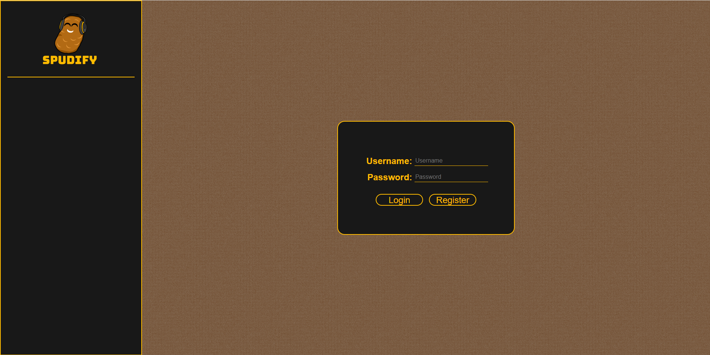
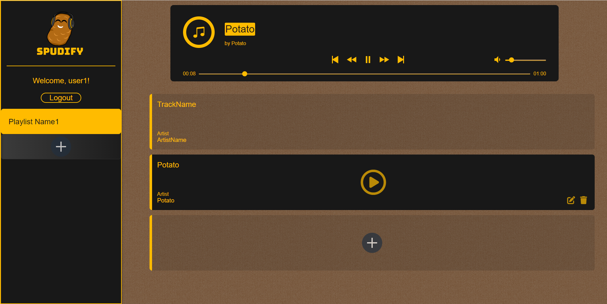

Spudify
=========

LHL Final Project

Team Members: Kade Kobussen, Shaun Ho, Justin Nguyen

## Summary

Allows users to upload music and create personal playlists so they can have all their music in one location stored on the web.

App name and design inspired by LHL instructor Francis Bourgouin and his love for potatoes.

## Backend (Express) Setup

From the root directory of the project, `cd server` and then please refer to [server README](./server/README.md) for backend setup instructions.

## Frontend (React) Setup

From the root directory of the project, `cd client` and then please refer to [client README](./client/README.md) for frontend setup instructions.

## Login Page View

## Main App View
